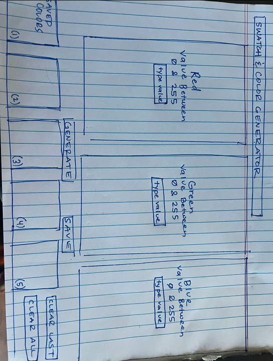

# Color Code Palette

## Description

We want to have a website where the user can input numbers for Red, Green, and Blue to make a color. Create 3-5 of these colors to make a Palette, then save and name the palette to then display it on a separate page to use for a project.

## User Story

As a Website Developer practicing Color Theory

I want to be able to generate a specific RGB color. I want to be able to choose the amount of Red, the amount of Green, and the amount of Blue. I want to create a box of this specific color (RGB). Do this 3-5 times to create a Theme. I want to then save these Themes to Local Storage to display it to a seperate HTML page

So that I can see different color combinations for my project

## Acceptance Criteria

GIVEN a choice on three colors by our choice of a number for each  to make a new color

WHEN I type in a number in the box for each color from 0-255

THEN I’m able to save the new color and repeat it 5 times to make a color palette and save it on a separate page

## Wireframe

## Credits

Nicole Barger

Gilmer Perez

Jonathan Maxen

Ivy Taff

## CSS Framework

Bootstrap

## Breakdown of Tasks/Pseudocode

Nicole Barger: CSS & JavaScript

Gilmer Perez: index HTML & JavaScript

Jonathan Maxen: localstorage HTML & JavaScript

Ivy Taff: CSS & JavaScript